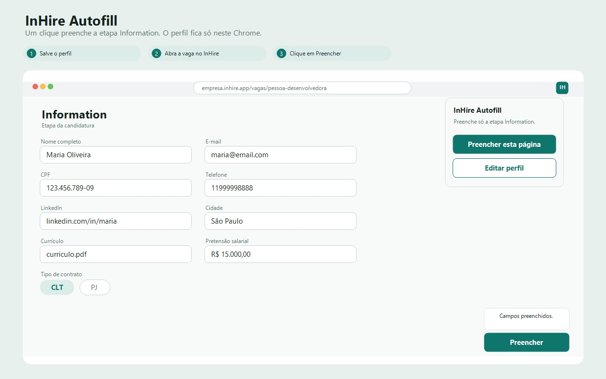

# InHire Autofill

Extensão Chrome (Manifest V3) que guarda um perfil neste navegador e preenche as etapas Information e Diversity das vagas em `*.inhire.app` quando a pessoa pede.

Status: V0 para uso local. Ainda não está na Chrome Web Store.

O comportamento fechado está em [docs/PRD.md](docs/PRD.md). Este arquivo é a porta de entrada do repositório.

## Para quem é

Quem se candidata no próprio Chrome e repete os mesmos campos em cada vaga do InHire.

## O que entra no V0

- Perfil salvo só neste Chrome, depois de confirmar que nada é enviado a um servidor.
- Preenchimento só no clique: botão flutuante na página ou botão no popup.
- Etapas Information e Diversity. O aceite da privacidade da vaga e o envio do formulário ficam de fora.

## Como usar

1. Em `chrome://extensions`, ativar o modo do desenvolvedor.
2. Carregar sem compactação e escolher esta pasta.
3. Abrir as opções da extensão, preencher o perfil e confirmar o aviso de dados locais.
4. Abrir uma vaga em `https://*.inhire.app` e clicar em preencher.
5. Conferir os campos antes de enviar a candidatura. A extensão não envia o formulário.

## Privacidade

O perfil fica em `chrome.storage.local`. A extensão não envia esses dados a um servidor. O cadastro só salva depois da confirmação de que nada é enviado a um servidor. O texto público está em [privacy.html](privacy.html).

## Chrome Web Store

Ainda não publicada. O print de 1280×800 está em [store/screenshot-como-funciona.jpg](store/screenshot-como-funciona.jpg). O texto da política está em [privacy.html](privacy.html) e vai para o site da Jeditech.

## Documentação

| Documento | Papel |
| --- | --- |
| [docs/PRD.md](docs/PRD.md) | Requisitos, escopo, fluxo, critérios de liberação e decisões |
| [docs/BACKLOG.md](docs/BACKLOG.md) | O que ainda está aberto |
| [docs/WORKFLOW.md](docs/WORKFLOW.md) | Branch, pull request e o que atualizar antes do merge |
| [docs/SEO.md](docs/SEO.md) | O que do checklist de Product SEO se aplica a este produto |
| [privacy.html](privacy.html) | Política de privacidade |

## Repositório

Não há commit direto na `main`. O fluxo está em [docs/WORKFLOW.md](docs/WORKFLOW.md).

Não há licença open source publicada. Até existir um arquivo `LICENSE`, o código permanece com todos os direitos reservados.
